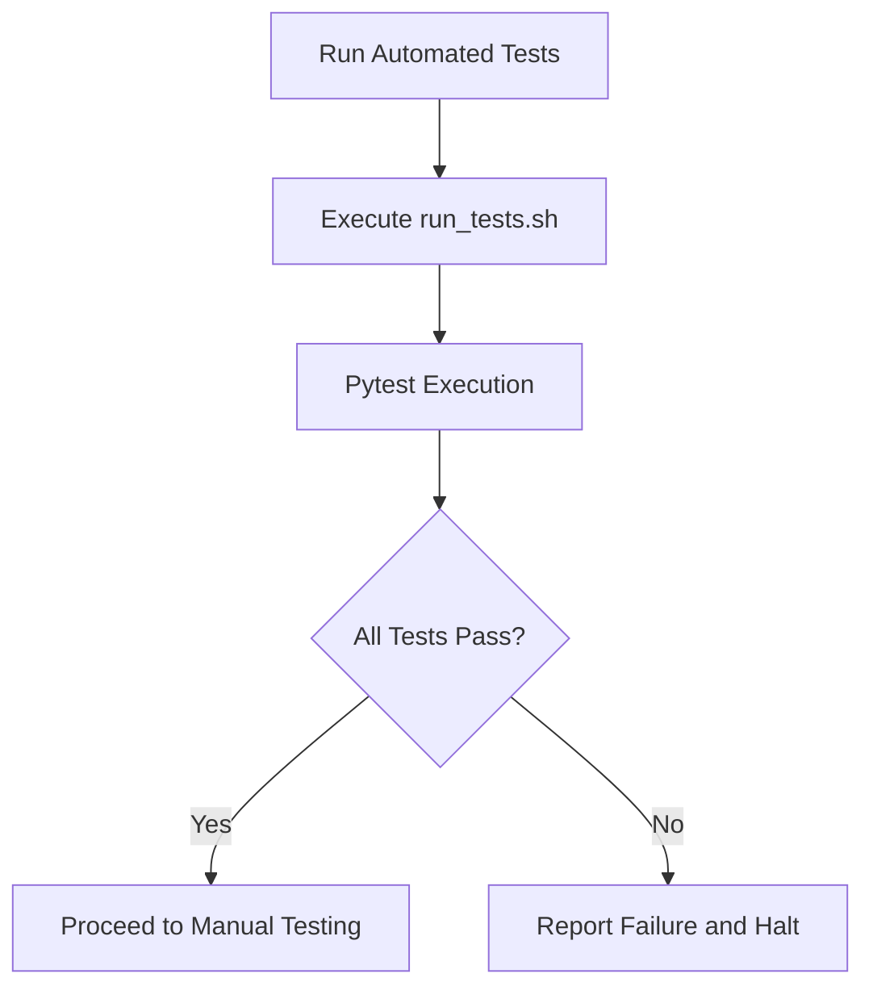
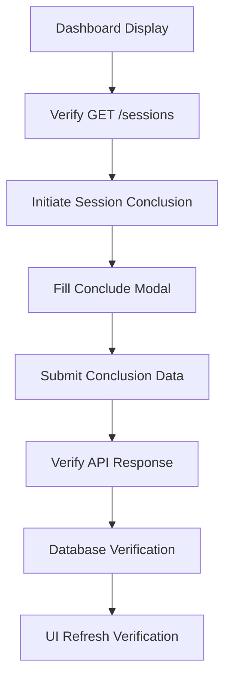
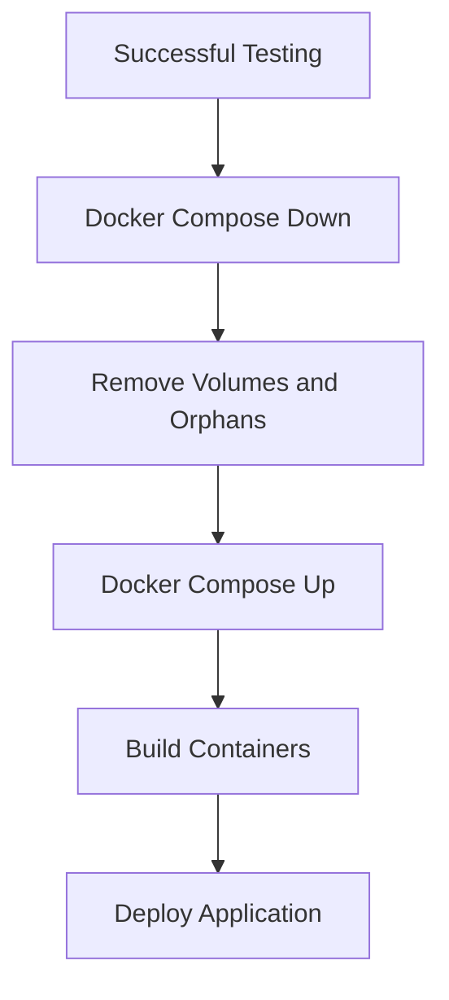

# Session Life Cycle Testing Design Document

## 1. Overview

This document outlines the comprehensive testing strategy for the newly implemented "Session Life Cycle" functionality in the AI Sales Co-Pilot system. The testing process will validate both backend API endpoints and frontend user interactions to ensure the complete workflow functions correctly before deployment.

## 2. System Architecture

### 2.1 Backend Components
- **Session Router**: Handles HTTP requests for session management
- **Session Repository**: Manages database operations for sessions
- **Session Schema**: Defines data models for sessions and session conclusion
- **API Endpoints**: 
  - `GET /sessions/` - Retrieve all sessions for dashboard
  - `POST /sessions/{session_id}/conclude` - Conclude a session with outcome data

### 2.2 Frontend Components
- **SessionList Component**: Displays sessions in dashboard with status differentiation
- **Session API Service**: Handles communication with backend endpoints
- **UI Workflows**: Manual interaction flows for session conclusion

## 3. Test Strategy

### 3.1 Backend Testing


### 3.2 Manual End-to-End Testing


### 3.3 Deployment Process


## 4. Test Cases

### 4.1 Backend API Tests

| Test Case | Description | Expected Result |
|-----------|-------------|-----------------|
| TC001 | Execute `run_tests.sh` script | All tests pass with status code 0 |
| TC002 | Run `pytest` in backend directory | All unit and integration tests pass |
| TC003 | Call `GET /sessions/` endpoint | Returns list of sessions with proper structure |
| TC004 | Call `POST /sessions/{session_id}/conclude` with valid data | Returns updated session with closed status |
| TC005 | Call `POST /sessions/{session_id}/conclude` with invalid session ID | Returns 404 Not Found |
| TC006 | Call `POST /sessions/{session_id}/conclude` for already closed session | Returns 400 Bad Request |

### 4.2 Frontend Manual Tests

| Test Case | Description | Expected Result |
|-----------|-------------|-----------------|
| TC101 | Dashboard loads and calls `GET /sessions` | Session list renders correctly |
| TC102 | Active sessions visually differentiated from closed | Active sessions show "Aktywna" status |
| TC103 | Click "Finalizuj Sesję" button | Conclude session modal opens |
| TC104 | Fill conclusion form with test data | Form accepts all required fields |
| TC105 | Submit conclusion form | Triggers `POST /sessions/{session_id}/conclude` |
| TC106 | API returns 200 OK | Session object updated with closed status |
| TC107 | Direct database query | Session status changed to closed with outcome_data |
| TC108 | Refresh dashboard | Concluded session shows as closed |

## 5. Data Models

### 5.1 Session Schema
```json
{
  "id": "integer",
  "client_id": "integer",
  "status": "string (active/closed)",
  "start_timestamp": "datetime",
  "end_timestamp": "datetime (optional)",
  "outcome_data": "object (optional)",
  "interactions": "array"
}
```

### 5.2 SessionConclusion Schema
```json
{
  "outcome": "string (required)",
  "notes": "string (optional)",
  "summary": "string (optional)"
}
```

## 6. API Endpoints

### 6.1 GET /sessions/
- **Method**: GET
- **Description**: Retrieve all sessions for dashboard display
- **Parameters**: skip (int), limit (int)
- **Response**: Array of Session objects

### 6.2 POST /sessions/{session_id}/conclude
- **Method**: POST
- **Description**: Conclude a session and set its status to 'closed'
- **Parameters**: session_id (path), SessionConclusion (body)
- **Response**: Updated Session object

## 7. Success Criteria

### 7.1 Phase 1: Automated Backend Tests
- All existing tests must pass without failures
- New session endpoint tests must execute successfully
- Test execution must complete with exit code 0

### 7.2 Phase 2: Manual End-to-End Verification
- Dashboard correctly displays sessions with proper status differentiation
- Session conclusion workflow completes without errors
- API responses match expected format and status codes
- Database records are properly updated
- UI reflects changes after refresh

### 7.3 Phase 3: Conditional Docker Deployment
- Only executed if both Phase 1 and Phase 2 succeed
- All containers stop and remove successfully
- All containers build and start without errors
- Application is accessible in browser
- New functionality works as expected

## 8. Error Handling

### 8.1 Test Failure Protocol
- Any test failure immediately halts the process
- Detailed error reporting for failed tests
- No deployment occurs if any phase fails

### 8.2 Rollback Procedure
- In case of deployment issues, previous containers can be restored
- Database state preserved through volume management
- Application functionality can be reverted to previous state

## 9. Validation Checklist

### 9.1 Pre-Testing
- [ ] Environment variables properly configured
- [ ] Docker containers running
- [ ] Database accessible
- [ ] API endpoints responsive

### 9.2 During Testing
- [ ] Backend tests execute successfully
- [ ] Manual workflow steps complete
- [ ] Data integrity verified at each step
- [ ] UI behaves as expected

### 9.3 Post-Testing
- [ ] All success criteria met
- [ ] No errors in logs
- [ ] Application functions correctly
- [ ] Deployment ready

## 10. Deployment Process

### 10.1 Prerequisites
- Successful completion of all test phases
- Proper permissions for Docker operations
- Backup of current deployment (if needed)

### 10.2 Steps
1. Execute `docker-compose down --volumes --remove-orphans`
2. Wait for complete shutdown of all containers
3. Execute `docker-compose up --build -d`
4. Verify all containers start successfully
5. Confirm application accessibility in browser

### 10.3 Verification
- [ ] All five containers start (backend, frontend, postgres, qdrant, redis)
- [ ] Application loads in browser
- [ ] Session dashboard functions correctly
- [ ] New session conclusion feature works as expected