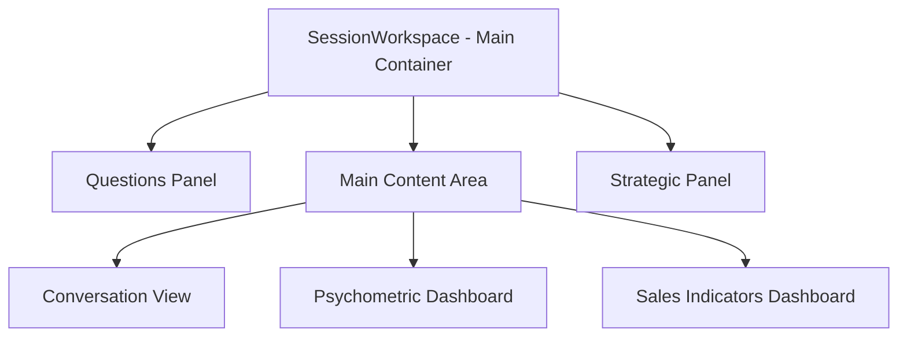
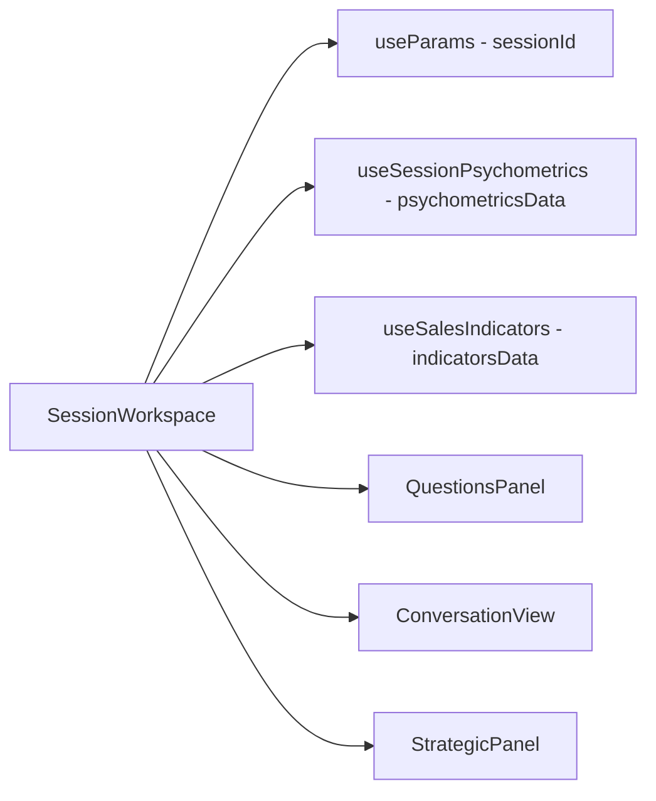

# Session Workspace Layout Fix Design Document

## Overview

This document outlines the design and implementation plan to fix the layout issues in the SessionWorkspace component. The current implementation has overlapping columns and responsiveness problems that prevent proper usage of the application. The fix will focus on restructuring the CSS Grid layout to ensure all three columns display correctly side-by-side on desktop and stack appropriately on smaller screens.

## Architecture

### Current Layout Structure

The SessionWorkspace component currently implements a Grid-based layout with three main columns:
1. **Questions Panel** (3/12 width on desktop)
2. **Main Content Area** (5/12 width on desktop) containing:
   - ConversationView component
   - PsychometricDashboard component
3. **Strategic Panel** (4/12 width on desktop)

### Identified Issues

1. **Nested Layout Conflicts**: The ConversationView component implements its own Grid layout, creating conflicts with the parent SessionWorkspace Grid
2. **Improper Height Management**: Components use conflicting height calculations (`calc(100vh - 64px)` vs `100%`)
3. **Component Sizing Issues**: Child components have fixed height constraints that don't adapt to parent container
4. **Responsiveness Problems**: Layout doesn't properly adapt to different screen sizes

### Solution Architecture

The solution involves:
1. Simplifying the component hierarchy to eliminate nested Grid conflicts
2. Implementing consistent height management across all components
3. Using proper Material-UI responsive breakpoints
4. Ensuring components properly fill available space



## Component Modifications

### SessionWorkspace.js

#### Current Implementation Issues
- Uses nested Box components within Grid items that create layout conflicts
- Improper height management with `calc(100vh - 64px)`
- Components don't properly fill available vertical space

#### Proposed Changes
1. **Restructure Grid Layout**:
   - Eliminate unnecessary Box wrappers
   - Ensure direct Grid item children
   - Implement proper column sizing (3/12, 5/12, 4/12)
   - Add explicit lg breakpoints for better control

2. **Fix Height Management**:
   - Use consistent `height: '100%'` for all components
   - Remove conflicting height calculations
   - Implement flex properties for proper space distribution
   - Add `overflow: 'hidden'` to main container to prevent scrollbars

3. **Improve Responsiveness**:
   - Define clear breakpoints for different screen sizes
   - Ensure proper stacking behavior on smaller screens
   - Add flex display properties to all containers

#### Specific Code Changes

The following changes need to be made to SessionWorkspace.js:

1. **Main Container**:
   ```javascript
   // Add overflow: 'hidden' to prevent scrollbars
   <Box sx={{ flexGrow: 1, p: 2, height: 'calc(100vh - 64px)', overflow: 'hidden' }}>
   ```

2. **Grid Items**:
   ```javascript
   // Add lg breakpoints and flex properties
   <Grid item xs={12} md={3} lg={3} sx={{ height: '100%', display: 'flex', flexDirection: 'column' }}>
   
   // Wrap components in Box with flex properties
   <Box sx={{ flexGrow: 1, display: 'flex', flexDirection: 'column', height: '100%' }}>
       <QuestionsPanel sessionId={sessionId} />
   </Box>
   ```

3. **Central Column**:
   ```javascript
   <Grid item xs={12} md={5} lg={5} sx={{ height: '100%', display: 'flex', flexDirection: 'column' }}>
       <Box sx={{ flexGrow: 1, mb: 2, display: 'flex', flexDirection: 'column', height: '100%' }}>
           <ConversationView sessionId={sessionId} onInteractionAdded={handleInteractionAdded} />
       </Box>
       
       <Box sx={{ flexGrow: 1, display: 'flex', flexDirection: 'column' }}>
           <PsychometricDashboard 
               sessionId={sessionId}
               psychometricsData={psychometricsData}
               psychometricsLoading={psychometricsLoading}
           />
       </Box>
   </Grid>
   ```

4. **Right Column**:
   ```javascript
   <Grid item xs={12} md={4} lg={4} sx={{ height: '100%', display: 'flex', flexDirection: 'column' }}>
       <Box sx={{ flexGrow: 1, display: 'flex', flexDirection: 'column', height: '100%' }}>
           <StrategicPanel sessionId={sessionId} />
       </Box>
       
       <Box sx={{ mt: 2, display: 'flex', flexDirection: 'column' }}>
           <SalesIndicatorsDashboard
               indicatorsData={salesIndicatorsData}
               loading={salesIndicatorsLoading}
               error={salesIndicatorsError}
               customerArchetype={psychometricsData?.archetype}
               psychologyConfidence={psychometricsData?.confidence_score}
               cumulativePsychology={psychometricsData?.big_five ? {
                   big_five: psychometricsData.big_five,
                   disc: psychometricsData.disc_profile,
                   schwartz_values: psychometricsData.schwartz_values
               } : null}
           />
       </Box>
   </Grid>
   ```

### Child Components

#### ConversationView.js
- Remove fixed height calculations that conflict with parent layout
- Adjust internal Grid to work within provided space
- Ensure components properly fill available vertical space
- Modify internal height calculations to work with flex layout
- Update `height: 'calc(100vh - 140px)'` to `height: '100%'`

#### PsychometricDashboard.js
- Remove fixed height constraints
- Ensure responsive behavior within parent container
- Add flex properties to container elements
- Ensure charts and visualizations adapt to available space

#### SalesIndicatorsDashboard.js
- Remove fixed height constraints
- Ensure proper sizing within available space
- Add flex properties to container elements
- Ensure indicators adapt to available space

#### QuestionsPanel.js & StrategicPanel.js
- Ensure proper height filling
- Remove conflicting layout properties
- Add `flex: 1` to main container
- Add `display: 'flex'` and `flexDirection: 'column'` to container
- Ensure content scrolls properly within available space

## Data Flow

The SessionWorkspace component fetches session data and passes it to child components:

1. **Session ID**: Retrieved from URL parameters using `useParams()`
2. **Psychometrics Data**: Fetched using `useSessionPsychometrics` hook
3. **Sales Indicators Data**: Fetched using `useSalesIndicators` hook
4. **Data Propagation**: Data passed down to child components as props



## UI Layout Specification

### Desktop Layout (lg screens)

| Component | Width | Height | Position |
|-----------|-------|--------|----------|
| Questions Panel | 3/12 (25%) | 100% | Left |
| Main Content Area | 5/12 (41.6%) | 100% | Center |
| Strategic Panel | 4/12 (33.3%) | 100% | Right |

### Tablet Layout (md screens)

| Component | Width | Height | Position |
|-----------|-------|--------|----------|
| Questions Panel | 12/12 (100%) | auto | Top |
| Main Content Area | 12/12 (100%) | 100% | Middle |
| Strategic Panel | 12/12 (100%) | auto | Bottom |

### Mobile Layout (sm/xs screens)

| Component | Width | Height | Position |
|-----------|-------|--------|----------|
| Questions Panel | 12/12 (100%) | auto | Top |
| Main Content Area | 12/12 (100%) | 100% | Middle |
| Strategic Panel | 12/12 (100%) | auto | Bottom |

## Technical Implementation

### CSS/Grid Properties

Implementation will use Material-UI's Grid system with these properties:

```javascript
// Desktop
<Grid item xs={12} md={3} lg={3}>
<Grid item xs={12} md={5} lg={5}>
<Grid item xs={12} md={4} lg={4}>

// Height management
sx={{ height: '100%', display: 'flex', flexDirection: 'column' }}
```

### Responsive Breakpoints

| Breakpoint | Screen Width | Layout Behavior |
|------------|--------------|-----------------|
| xs | <600px | Single column stack |
| sm | 600-960px | Single column stack |
| md | 960-1280px | Questions/Strategic panels above main content |
| lg | 1280-1920px | Three column layout |
| xl | >1920px | Three column layout |

### Height Management Strategy

1. Main container: `height: 'calc(100vh - 64px)'`
2. Child components: `height: '100%'`
3. Content distribution: Using flex properties
4. Scroll handling: Individual component scrolling where needed

## Success Criteria

After implementation, the SessionWorkspace must:

1. **Desktop View**:
   - Display three clearly separated vertical columns
   - Columns must not overlap
   - Proper width distribution (3:5:4 ratio)
   - Full height utilization without vertical scrollbars

2. **Tablet View**:
   - Questions and Strategic panels stack above Conversation area
   - Proper spacing and sizing of components
   - No horizontal scrolling

3. **Mobile View**:
   - All components stack vertically
   - Proper spacing and readability
   - No horizontal scrolling
   - Appropriate touch targets

4. **General Requirements**:
   - Fully responsive layout
   - Consistent styling with rest of application
   - No performance degradation
   - Maintain all existing functionality

## Testing Approach

### Unit Testing

1. Test component rendering with different screen sizes
2. Verify proper prop passing to child components
3. Validate responsive behavior at breakpoints

### Integration Testing

1. Test complete layout rendering in browser
2. Verify data flow from hooks to components
3. Check layout behavior during resizing
4. Verify no horizontal scrollbars appear
5. Confirm components fill available vertical space

### Cross-browser Testing

1. Test on Chrome, Firefox, Safari, Edge
2. Verify consistent behavior across browsers
3. Check mobile browser compatibility

### Responsive Testing

1. Test various screen sizes and orientations
2. Confirm proper breakpoint behavior
3. Verify mobile touch interactions
4. Check stacking behavior on tablet and mobile
5. Confirm proper spacing and alignment at all breakpoints

### Visual Testing

1. Verify no overlapping elements
2. Confirm proper column widths
3. Check consistent spacing between elements
4. Verify proper alignment of components
5. Confirm appropriate use of available space

## Dependencies

- Material-UI Grid and Box components
- React Router for session ID management
- Custom hooks: `useSessionPsychometrics`, `useSalesIndicators`
- Child components: `QuestionsPanel`, `ConversationView`, `StrategicPanel`

## Implementation Steps

### Step 1: Modify SessionWorkspace.js
1. Update main container with `overflow: 'hidden'`
2. Add lg breakpoints to all Grid items
3. Wrap all components in Box containers with flex properties
4. Add display flex properties to all Grid items

### Step 2: Update Child Components
1. Modify ConversationView.js to work with flex layout
2. Update PsychometricDashboard.js to remove fixed heights
3. Update SalesIndicatorsDashboard.js to remove fixed heights
4. Update QuestionsPanel.js and StrategicPanel.js with flex properties

### Step 3: Testing
1. Test layout on different screen sizes
2. Verify no overlapping elements
3. Confirm proper responsive behavior
4. Check data flow still works correctly

## Rollback Plan

If issues arise after deployment:

1. Revert SessionWorkspace.js to previous version
2. Restore any modified child components
3. Validate layout functionality with previous implementation
4. Identify specific issue and implement targeted fix

## Conclusion

This design document provides a comprehensive approach to fixing the SessionWorkspace layout issues. The key changes include:

1. **Layout Restructuring**: Simplifying the component hierarchy by adding proper flex properties and removing nested containers that caused conflicts
2. **Height Management**: Implementing consistent height handling with `height: 100%` and flex properties instead of fixed calculations
3. **Responsive Design**: Adding explicit lg breakpoints and ensuring proper stacking behavior on different screen sizes
4. **Component Modifications**: Updating child components to work properly within the new flex layout

By implementing these changes, we will achieve:
- Three clearly separated vertical columns on desktop
- No overlapping elements
- Proper responsive behavior on all screen sizes
- Full height utilization without scrollbars
- Consistent styling with the rest of the application

The implementation follows a phased approach to minimize risk and ensure proper testing at each step.