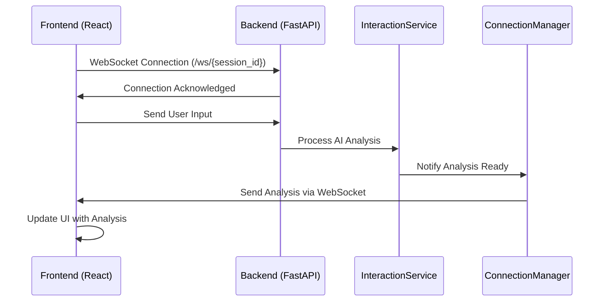

# WebSocket Communication Setup Design Document

## 1. Overview

### 1.1 Purpose
Replace the current polling-based communication mechanism with a fully asynchronous, bidirectional WebSocket communication to eliminate delays and ensure immediate delivery of AI analysis to the user interface.

### 1.2 Current State
The system currently uses Server-Sent Events (SSE) for streaming AI responses from the backend to the frontend. The frontend polls for updates, which introduces latency and inefficient resource usage.

### 1.3 Target State
Implement WebSocket communication to provide real-time, bidirectional communication between frontend and backend, enabling immediate delivery of AI analysis and reducing server load.

## 2. Architecture

### 2.1 System Components
- **Backend (FastAPI)**: WebSocket server implementation in `stream.py`
- **Frontend (React)**: WebSocket client implementation in `ConversationStream.js`
- **Connection Manager**: Backend component to manage active WebSocket connections
- **Integration Layer**: Modification of `InteractionService` to notify WebSocket clients

### 2.2 Communication Flow


## 3. Backend Implementation (FastAPI)

### 3.1 WebSocket Endpoint
File: `backend/app/routers/stream.py`

#### Features:
- New endpoint: `/ws/{session_id}`
- Listens for incoming connections from frontend
- Validates session existence before accepting connection
- Uses FastAPI's WebSocket support with `WebSocketDisconnect` handling
- Implements heartbeat mechanism to maintain connection health

### 3.2 Connection Manager
File: `backend/app/routers/stream.py`

#### Responsibilities:
- Store active WebSocket connections for each session
- Manage connection lifecycle (connect/disconnect)
- Broadcast messages to specific session clients
- Handle connection errors and cleanup
- Implement connection timeout handling
- Support multiple clients per session (if needed in future)

#### Implementation Details:
```python
class ConnectionManager:
    def __init__(self):
        # Store connections by session_id
        self.active_connections: Dict[int, List[WebSocket]] = {}
    
    async def connect(self, websocket: WebSocket, session_id: int):
        # Accept connection and store it
        pass
        
    def disconnect(self, websocket: WebSocket, session_id: int):
        # Remove connection from storage
        pass
        
    async def send_personal_message(self, message: str, session_id: int):
        # Send message to specific session clients
        pass
```

### 3.3 Integration with Business Logic
File: `backend/app/services/interaction_service.py`

#### Modifications:
- Modify `create_interaction_with_ai_analysis` method to notify ConnectionManager
- Add WebSocket notification after AI analysis completion
- Ensure error handling for WebSocket communication
- Implement dependency injection for ConnectionManager

#### Implementation Approach:
1. Create singleton instance of ConnectionManager
2. Inject ConnectionManager into InteractionService
3. After AI analysis completion, call ConnectionManager to broadcast results
4. Handle cases where no WebSocket clients are connected for a session

## 4. Frontend Implementation (React)

### 4.1 Component Modification
File: `frontend/src/components/conversation/ConversationStream.js`

#### Changes:
- Remove polling logic (`setInterval`)
- Implement WebSocket connection logic
- Add message listener for incoming AI analysis
- Implement error handling and reconnection logic

#### Implementation Details:
1. Create WebSocket connection when session is established
2. Store WebSocket instance in component state
3. Add event listeners for `onopen`, `onmessage`, `onerror`, and `onclose`
4. Update component state with AI analysis when received via WebSocket
5. Implement cleanup logic to close WebSocket connection on component unmount

### 4.2 WebSocket Client Features
- Establish persistent connection to `/ws/{session_id}` endpoint
- Handle connection lifecycle (open/close/error)
- Process incoming messages and update component state
- Implement automatic reconnection on connection loss

#### Reconnection Strategy:
- Exponential backoff for reconnection attempts
- Maximum retry limit to prevent infinite loops
- User notification after multiple failed attempts

#### Message Handling:
- Parse incoming JSON messages
- Identify message types (analysis_complete, error, etc.)
- Update appropriate component state based on message type
- Handle partial messages or malformed JSON gracefully

## 5. Data Models

### 5.1 WebSocket Message Structure
```json
{
  "event": "analysis_complete",
  "session_id": 123,
  "data": {
    "interaction_id": 456,
    "ai_response": {
      "main_analysis": "...",
      "quick_response": "...",
      "sales_indicators": {...}
    }
  },
  "timestamp": "2023-01-01T00:00:00Z"
}
```

#### Message Types:
- `analysis_complete`: Full AI analysis result
- `token_stream`: Individual tokens for streaming display
- `error`: Error messages from backend
- `heartbeat`: Connection health check

### 5.2 Connection Management
- Session-based connection mapping
- Connection state tracking (active/inactive)
- Cleanup on session completion
- Support for multiple concurrent connections per session

#### Connection States:
- `connecting`: Establishing WebSocket connection
- `connected`: Active connection ready for communication
- `disconnected`: Connection closed (intentional)
- `failed`: Connection closed due to error
- `reconnecting`: Attempting to reestablish connection

## 6. Error Handling & Recovery

### 6.1 Backend
- Graceful handling of connection drops
- Automatic cleanup of stale connections
- Error logging and monitoring

#### Implementation Details:
- Use try/except blocks around WebSocket operations
- Implement connection timeout handling
- Log disconnection reasons for debugging
- Clean up connection references to prevent memory leaks

### 6.2 Frontend
- Automatic reconnection attempts
- Fallback to polling if WebSocket fails
- User notifications for connection issues

#### Implementation Details:
- Implement WebSocket event handlers for all possible events
- Show user-friendly error messages
- Provide manual reconnection option
- Log errors to console for debugging
- Fallback to existing polling mechanism if WebSocket fails repeatedly

## 7. Security Considerations

### 7.1 Authentication
- Session validation before accepting WebSocket connections
- Token-based authentication for WebSocket upgrade
- Validate user permissions for session access

#### Implementation Approach:
- Extract session ID from URL path parameter
- Verify session exists and is active
- Check user authorization to access session
- Reject connections with invalid credentials

### 7.2 Data Validation
- Input validation for all WebSocket messages
- Rate limiting to prevent abuse
- Sanitize data before processing

#### Implementation Approach:
- Validate message format and required fields
- Limit message size to prevent buffer overflow
- Implement rate limiting per connection
- Log suspicious activities for security monitoring

## 8. Performance Optimization

### 8.1 Connection Management
- Efficient storage of active connections
- Memory optimization for connection objects

#### Implementation Details:
- Use dictionary with session_id as key for O(1) lookups
- Implement connection cleanup to prevent memory leaks
- Monitor connection count for scaling decisions
- Use weak references where appropriate

### 8.2 Message Broadcasting
- Targeted message delivery to specific sessions
- Minimize unnecessary data transmission

#### Implementation Details:
- Send messages only to relevant session connections
- Compress large messages when beneficial
- Batch messages when appropriate
- Implement message queuing for high-load scenarios

## 9. Testing Strategy

### 9.1 Unit Tests
- WebSocket connection handling
- Message broadcasting logic
- Error scenarios

#### Test Cases:
- Successful connection establishment
- Connection rejection for invalid sessions
- Message sending to connected clients
- Proper cleanup on disconnect
- Error handling for malformed messages

### 9.2 Integration Tests
- End-to-end WebSocket communication
- Session lifecycle with WebSocket
- Load testing with multiple connections

#### Test Cases:
- Complete flow from user input to AI analysis delivery
- Multiple clients connecting to same session
- Connection recovery after server restart
- Performance under high concurrent load

### 9.3 Frontend Tests
- WebSocket connection establishment
- Message handling and UI updates
- Error recovery scenarios

#### Test Cases:
- Connection UI state updates
- Display of streamed AI responses
- Reconnection behavior on network loss
- Fallback to polling mechanism
- Error message display for users