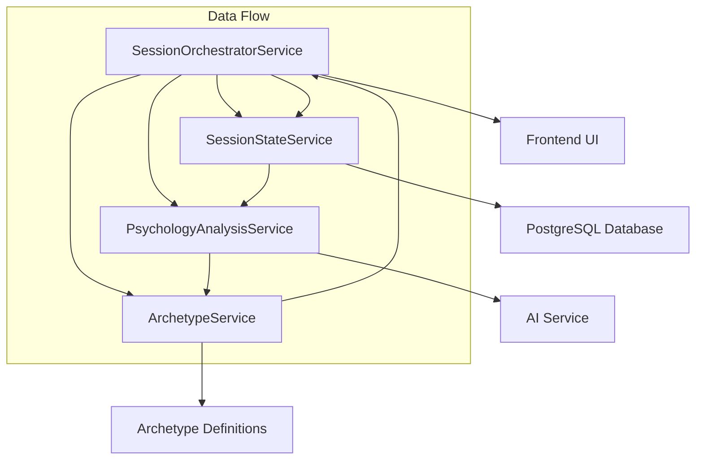

# SessionPsychologyService Decomposition Analysis
## Phase 2 Preparation - Monolith Dismantling Plan

### Executive Summary
The `SessionPsychologyService` (1050 lines) is a complex monolithic service that handles multiple responsibilities related to psychological analysis, customer archetype detection, and session state management. This analysis provides a comprehensive breakdown and proposes a logical decomposition into 4 specialized services.

---

## 🔍 **Current Architecture Analysis**

### Core Components Identified:
1. **SessionPsychologyEngine** - Main class (1050 lines)
2. **Customer Archetype Definitions** - Static data structures
3. **AI Response Processing** - Parsing and validation logic
4. **Database Session Management** - State persistence
5. **Tesla-Specific Archetype Mapping** - Business logic

---

## 📊 **Identified Responsibilities**

### 1. **Psychometric Analysis** (Lines 300-500)
**Methods:**
- `_build_cumulative_psychology_prompt()`
- `_parse_psychology_ai_response()`
- `_validate_and_repair_psychology()`

**Responsibilities:**
- Big Five personality trait analysis
- DISC assessment processing
- Schwartz values evaluation
- AI prompt construction for psychological analysis
- Response parsing and validation

**Data Dependencies:**
- AI service for LLM calls
- Session interaction history
- Psychology confidence scoring

### 2. **Customer Archetype Detection & Evolution** (Lines 150-300, 950-1050)
**Methods:**
- `_map_profile_to_tesla_archetype()`
- Archetype definitions: `CUSTOMER_ARCHETYPES`, `TESLA_CUSTOMER_ARCHETYPES`

**Responsibilities:**
- General customer archetype mapping
- Tesla-specific archetype detection
- Confidence scoring for archetype assignment
- Sales strategy recommendations
- Communication style analysis

**Data Dependencies:**
- Psychometric analysis results
- Business-specific archetype rules
- Customer behavior patterns

### 3. **Session State Management & Data Aggregation** (Lines 650-800)
**Methods:**
- `_update_session_psychology()`
- `_build_session_history()`
- `_build_session_conversation_history()`

**Responsibilities:**
- Session data persistence to database
- Interaction history aggregation
- Cumulative psychology profile building
- Session confidence tracking
- Timestamp management

**Data Dependencies:**
- PostgreSQL database session
- Session and Interaction models
- SQLAlchemy ORM operations

### 4. **Interactive Question Management** (Lines 500-650)
**Methods:**
- `answer_clarifying_question()`
- `_convert_to_interactive_questions()`

**Responsibilities:**
- Converting AI suggestions to interactive UI questions
- Processing salesperson responses to clarifying questions
- Managing active question state
- Question lifecycle management

**Data Dependencies:**
- Session active_clarifying_questions field
- UI question format requirements
- Psychological targeting logic

### 5. **Session Orchestration & Main Flow** (Lines 700-950)
**Methods:**
- `update_and_get_psychology()` - Main entry point
- `update_cumulative_profile()` - Deprecated legacy method
- `_create_fallback_psychology_profile()`

**Responsibilities:**
- Coordinating the entire psychology analysis workflow
- Managing the sequence of analysis steps
- Error handling and fallback mechanisms
- Synchronous analysis coordination

---

## 🏗️ **Proposed Service Decomposition**

### Service 1: **PsychologyAnalysisService**
**Single Responsibility:** Pure psychometric analysis of customer interactions

**Key Methods:**
```python
class PsychologyAnalysisService:
    async def analyze_big_five_traits(self, conversation_history: str) -> Dict
    async def analyze_disc_profile(self, conversation_history: str) -> Dict
    async def analyze_schwartz_values(self, conversation_history: str) -> Dict
    async def calculate_psychology_confidence(self, analysis_results: Dict) -> int
    def validate_psychology_data(self, raw_analysis: Dict) -> Dict
    def create_fallback_profile(self) -> Dict
```

**Dependencies:**
- AI Service (for LLM calls)
- Psychology validation rules
- Confidence calculation algorithms

**Data Input:** Conversation history, existing psychology profile
**Data Output:** Complete psychometric analysis with confidence scores

---

### Service 2: **ArchetypeService**
**Single Responsibility:** Customer archetype detection and business logic

**Key Methods:**
```python
class ArchetypeService:
    def map_to_general_archetype(self, psychology_profile: Dict) -> Dict
    def map_to_tesla_archetype(self, psychology_profile: Dict) -> Dict
    def calculate_archetype_confidence(self, psychology_profile: Dict) -> int
    def get_sales_strategy(self, archetype_key: str) -> Dict
    def get_communication_style(self, archetype_key: str) -> str
```

**Dependencies:**
- Customer archetype definitions (static data)
- Tesla archetype definitions (static data)
- Business rules for archetype mapping

**Data Input:** Psychology profile from PsychologyAnalysisService
**Data Output:** Customer archetype with sales strategies and communication guidelines

---

### Service 3: **SessionStateService**
**Single Responsibility:** Session data management and persistence

**Key Methods:**
```python
class SessionStateService:
    async def update_session_psychology(self, session_id: int, psychology_data: Dict) -> None
    async def get_session_history(self, session_id: int) -> List[Interaction]
    async def save_psychology_profile(self, session_id: int, profile: Dict) -> None
    async def manage_active_questions(self, session_id: int, questions: List[Dict]) -> None
    def build_conversation_history(self, interactions: List[Interaction]) -> str
```

**Dependencies:**
- PostgreSQL database
- Session and Interaction models
- SQLAlchemy ORM

**Data Input:** Session ID, psychology analysis results, archetype data
**Data Output:** Updated session state, conversation history

---

### Service 4: **SessionOrchestratorService**
**Single Responsibility:** Coordination and workflow management

**Key Methods:**
```python
class SessionOrchestratorService:
    async def update_and_get_psychology(self, session_id: int) -> Dict
    async def answer_clarifying_question(self, session_id: int, question_id: str, answer: str) -> Dict
    def convert_to_interactive_questions(self, suggested_questions: List[Dict]) -> List[Dict]
    async def orchestrate_full_analysis(self, session_id: int) -> Dict
```

**Dependencies:**
- PsychologyAnalysisService
- ArchetypeService  
- SessionStateService
- Interactive question management logic

**Data Input:** Session ID, user interactions
**Data Output:** Complete psychology profile with UI-ready data

---

## 🔄 **Service Communication Flow**



---

## 📋 **Migration Strategy**

### Phase 2A: Create New Services (Week 1)
1. Create `PsychologyAnalysisService` with pure analysis logic
2. Create `ArchetypeService` with business rules
3. Create `SessionStateService` with database operations
4. Create `SessionOrchestratorService` as coordinator

### Phase 2B: Integration Testing (Week 2)
1. Unit tests for each service independently
2. Integration tests for service communication
3. End-to-end testing with existing frontend
4. Performance comparison with monolith

### Phase 2C: Deployment Strategy (Week 3)
1. Deploy new services alongside existing monolith
2. Feature flag to switch between old/new implementation
3. Gradual migration of production traffic
4. Monitor performance and error rates

### Phase 2D: Cleanup (Week 4)
1. Remove old monolith code
2. Update documentation
3. Optimize service boundaries
4. Implement advanced monitoring

---

## ⚠️ **Critical Dependencies to Handle**

### Database Session Management
- Current: Single AsyncSession shared across all operations
- New: Each service needs proper session management
- Solution: Dependency injection of database sessions

### AI Service Integration
- Current: Direct calls to `ai_service_unified`
- New: PsychologyAnalysisService needs AI service dependency
- Solution: Inject AI service as dependency

### Error Handling
- Current: Centralized error handling with fallbacks
- New: Distributed error handling across services
- Solution: Standardized error handling patterns

### Static Data Management
- Current: Large archetype definitions in class
- New: Separate archetype data management
- Solution: Configuration service or data repository

---

## 🎯 **Expected Benefits**

### Code Maintainability
- ✅ Single Responsibility Principle per service
- ✅ Easier unit testing (smaller code units)
- ✅ Clearer error isolation
- ✅ Independent development velocity

### Performance
- ✅ Potential for service-level optimization
- ✅ Better resource allocation
- ✅ Reduced memory footprint per service

### Scalability
- ✅ Independent service scaling
- ✅ Technology stack flexibility
- ✅ Easier feature development

### Business Value
- ✅ Faster implementation of new psychology models
- ✅ A/B testing of different archetype strategies
- ✅ Easier integration with external psychology APIs

---

## 🚀 **Ready for Implementation**

This analysis provides the complete roadmap for safely "dismantling" the SessionPsychologyService monolith. Each proposed service has:

1. **Clear boundaries** - Well-defined responsibilities
2. **Defined interfaces** - Input/output specifications  
3. **Dependency maps** - External service requirements
4. **Migration path** - Step-by-step implementation plan

**Next Step:** Begin implementation of Phase 2A with the PsychologyAnalysisService as the first extraction target.